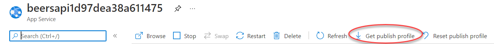

# Escenario 1: Despliegue inicial

En este escenario vas a crear la infraestructura inicial y a desplegarla en Azure

## Crear infraestructura inicial con Terraform

Para crear la infraestructura inicial se usa Terraform. Para ello vete a la carpeta `/deploy/terraform` y ejecuta el comando `terraform init`.

Luego create un fichero `demo1.tfvars` con el siguiente contenido:

```
scenario    = 1
pgsql_password = "Passw0rd!"
```

Luego ejecuta los comandos

```
terraform plan  -var-file .\demo1.tfvars -out plans\scenario1`
terraform apply plans\scenario1
```

## Seed de imágenes y BBDD

Ejecuta los siguientes comandos **desde la carpeta `/deploy/scripts`:

```
.\seed-images.ps1 -ResourceGroup beers
.\seed-database.ps1 -DbPassword Passw0rd! -ResourceGroup beers
```

> Nota: En el parámetro `-DbPassword` debes poner la misma contraseña que usaste en el fichero `demo1.tfvars`

## Despliegue en Azure

Para desplegar en Azure se usa Github actions. Para ello debes añadir los siguientes secretos en el repo:

* `beersapiname`: Nombre del appservice que contiene la api
* `beersapiprofile`: Publish profile del appservice que contiene la api
* `beerswebname`: Nombre del appservice que contiene la web
* `beerswebprofile`: Publish profile del appservice que contiene la web

Para obtener el publish profile debes irte al portal, al appservice y en "Overview" pulsar en el botón "Get Publish Profile" de la barra superior:



Luego copias y pegas el contenido de ese fichero en el secreto de github


